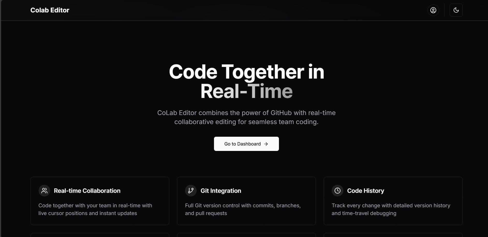
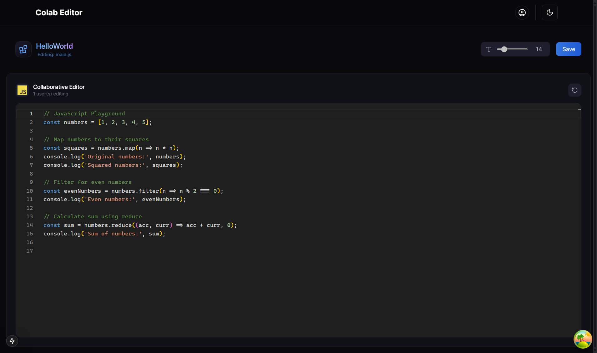
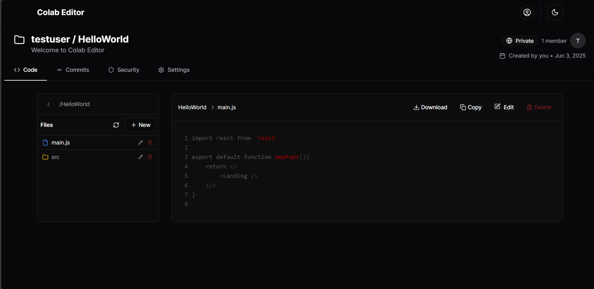

# 🧠 Collab Editor

A real-time, GitHub-like collaborative code editor built with **Next.js**, **Supabase**, and **React Query**. It supports OAuth login, versioned project structure, live VS Code-style file editing, and file system with folders and commits.

---

## 🚀 Features

### 🔐 Authentication
- OAuth login using Supabase (Google/GitHub)
- Secure session handling and access control

### 🏠 Landing Page
- Clean, responsive design with theme toggle
- Built using **shadcn/ui** and **Magic UI**

### 📁 GitHub-Style Project Structure
- Create projects with folders and files
- Hierarchical file tree with directory and file support
- Metadata stored and versioned in Supabase

### 💻 Live Editor
- Real-time collaborative editing (Monaco-based)
- VS Code-style layout with syntax highlighting
- Code suggestions and language mode support

### 📝 Commit History
- Tracks file changes as commits
- View commit logs for projects
- Structured using `commits`, `file_changes`, and `file_tree` tables in Supabase

### ✨ UX Enhancements
- Dark/light theme toggle
- Responsive layout
- Realtime sync with database via React Query

---

## 🛠 Tech Stack

| Layer      | Technologies                             |
|------------|------------------------------------------|
| Frontend   | Next.js, React, React Query              |
| Backend    | Supabase (PostgreSQL, Auth, Storage)     |
| UI/UX      | Tailwind CSS, shadcn/ui, Magic UI        |
| Editor     | Monaco Editor (VS Code-like experience)  |
| Auth       | Supabase OAuth                           |
| State Mgmt | React Query                              |

---

## 📸 Screenshots

> Make sure to place your screenshots in a `/screenshots` folder in your repo.

| Landing Page | Editor View | File Tree |
|--------------|-------------|-----------|
|  |  |  |

---

## 🌐 Live Demo

🔗 [collab-editor.example.com](https://collab-editor.example.com)

> Replace this link with your actual deployed URL.

---

## 📦 Getting Started

### 1. Clone the Repository

```bash
git clone https://github.com/ajs1109/collab-editor.git
cd collab-editor
```

### 2. Install Dependencies

```bash
npm install
```

### 3. Set Environment Variables

Create a .env.local file with the .env.example

### 4. Run the Development Server

```bash
npm run dev
```

The app will be available at http://localhost:3000.

## 🤝 Contributing
Contributions are welcome!
Please open issues or pull requests for features, bugs, or improvements.

